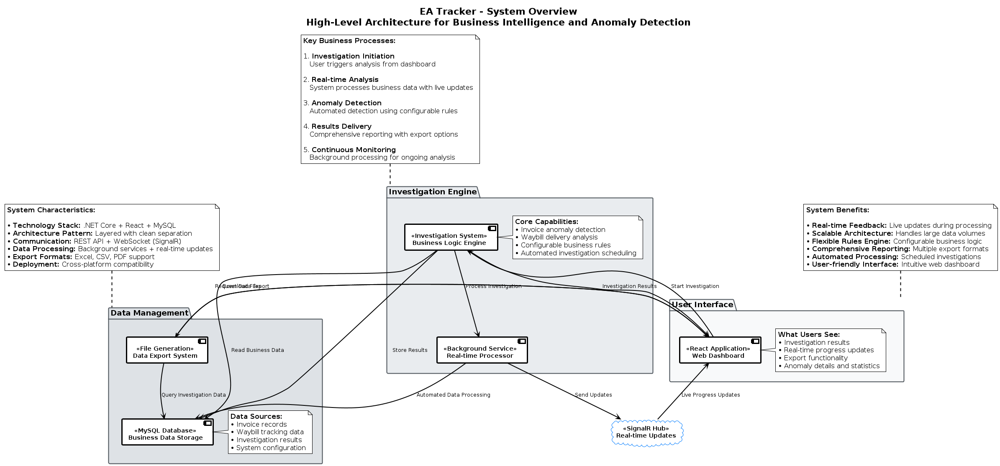
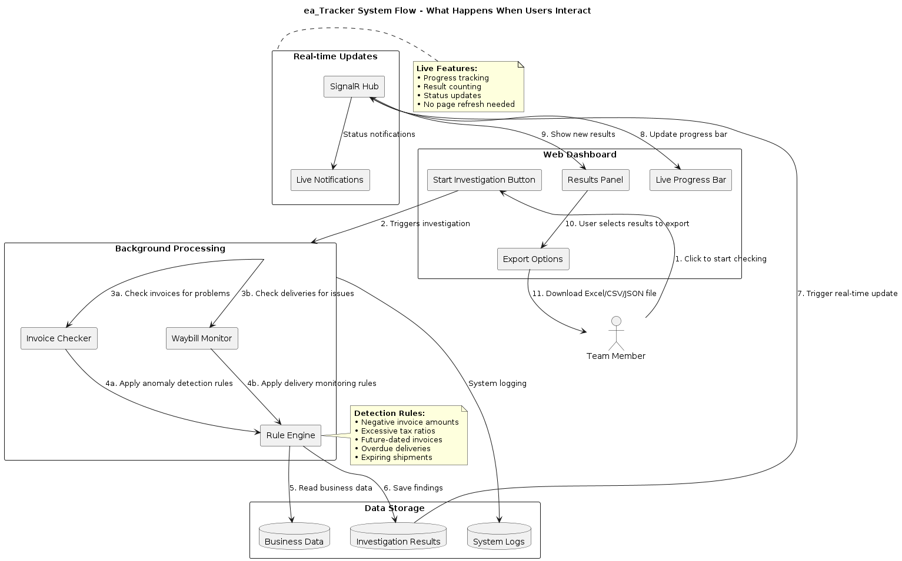
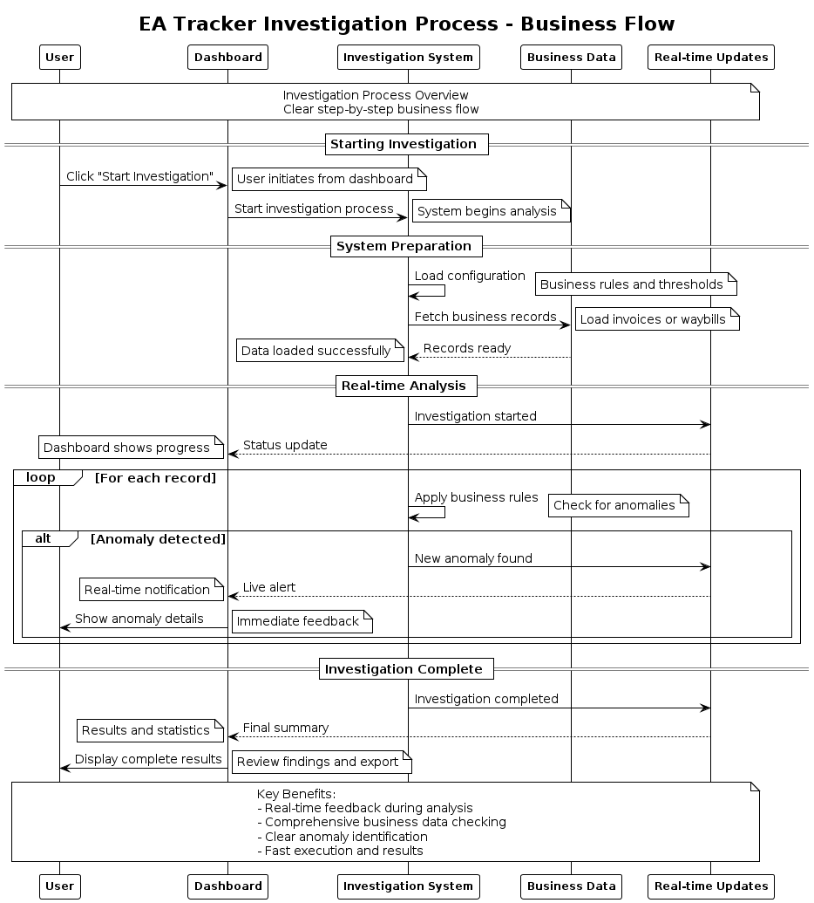

# ea_Tracker: Team Presentation

## What is ea_Tracker?

ea_Tracker is a web application that automatically detects problems in financial and shipping data. Think of it as a system that continuously monitors invoices and delivery records, flagging anything that looks suspicious or problematic.

**The main purpose**: Instead of manually checking thousands of invoices and waybills for issues, ea_Tracker does it automatically and shows you exactly what needs attention.

---

## What Can Users Actually Do?

### 1. **Start Investigations**
- Click a button to run checks on all invoices or waybills
- Watch real-time progress updates
- See how many anomalies were found

### 2. **View Results**
- Browse through flagged items in an organized list
- Click on any result to see detailed explanations
- Understand exactly why something was flagged

### 3. **Export Data**
- Download investigation results in Excel, CSV, or JSON format
- Select specific results or export everything
- Use exported data for further analysis or reporting

### 4. **Monitor System Activity**
- See a history of all investigations run
- Track when investigations were executed and by whom
- Monitor system performance and investigation success rates

---

## Key Features

### Invoice Anomaly Detection
**What it catches:**
- Invoices with negative amounts (red flag for accounting)
- Tax amounts that are way too high (over 50% of invoice total)
- Invoices dated in the future (data entry errors)

### Waybill Delivery Monitoring
**What it tracks:**
- Shipments that are overdue for delivery
- Packages that will expire soon
- Old waybills with missing due dates

### Real-time Updates
**How it works:**
- Dashboard updates automatically while investigations run
- No need to refresh the page
- See progress bars and live counters

### Export Functionality
**Available formats:**
- Excel spreadsheets (.xlsx) - formatted and ready for analysis
- CSV files - for importing into other tools
- JSON data - for developers and APIs

---

## Technology Stack

### Backend (.NET 8)
- **API**: ASP.NET Core Web API for handling requests
- **Database**: MySQL for storing all data
- **Real-time**: SignalR for live dashboard updates
- **Business Logic**: Separate classes for investigation rules

### Frontend (React)
- **Framework**: React with TypeScript for type safety
- **UI**: Modern, responsive design
- **Communication**: Axios for API calls, SignalR for real-time updates

### Testing
- **Backend**: Unit tests for business logic, integration tests for APIs
- **Frontend**: Jest for component testing, Cypress for end-to-end testing
- **Coverage**: Over 95% test coverage for critical components

---

## How It Works (Simple System Flow)

```
User clicks "Start Investigation" 
    ↓
System creates new investigation instance
    ↓
Background service processes all records
    ↓
Business logic checks each record for problems
    ↓
Results are saved to database
    ↓
Dashboard updates in real-time via SignalR
    ↓
User can view, filter, and export results
```

### Data Flow Example:
1. **Input**: System reads invoice data from database
2. **Processing**: Checks each invoice against configured rules
3. **Detection**: Flags invoices that violate business rules
4. **Storage**: Saves results with detailed explanations
5. **Display**: Shows results on dashboard with real-time updates
6. **Export**: Allows users to download findings in multiple formats

---

## System Architecture Overview

This high-level system diagram shows the main components of ea_Tracker and how they work together. It provides a clear view of the system's architecture from a business perspective, making it easy to understand how data flows through the system and how different parts interact.



## Flow Diagrams two different approach

This diagram illustrates the complete user interaction flow in ea_Tracker, showing how team members initiate investigations, how the system processes data in the background, and how results are delivered back to users in real-time. The diagram demonstrates the system's modular architecture with clear separation between user interface, business logic, data storage, and real-time communication components.



## Investigation Process Flow

This sequence diagram shows the step-by-step business process that happens when users start an investigation. It demonstrates how the system handles user interactions, processes business data, and provides real-time feedback throughout the investigation lifecycle.




---

## Current Status (What's Working)

### ✅ **Fully Implemented**
- Complete web dashboard with React frontend
- RESTful API backend with .NET Core
- Real-time updates using SignalR
- MySQL database with automatic migrations
- Invoice anomaly detection with configurable rules
- Waybill delivery monitoring
- Export functionality (Excel, CSV, JSON)
- Comprehensive testing suite

### ✅ **Tested and Working**
- All major features have unit tests
- Integration tests for API endpoints
- End-to-end tests with Cypress
- SignalR real-time communication tested
- Export functionality validated

### ✅ **Production Ready Features**
- Health check endpoints for monitoring
- Comprehensive error handling
- Database connection pooling
- Automatic database setup and migrations
- Configurable business rules via settings files

### 🔄 **Areas for Future Enhancement**
- User authentication (currently no login required)
- Advanced filtering and search
- Machine learning for better anomaly detection
- Multi-tenant support for different organizations

---

## Demo Highlights (Cool Things to Show)

### 1. **Real-time Investigation**
- Start an investigation and watch the progress bar move
- See results appear in real-time without refreshing
- Watch the anomaly counter increase as problems are found

### 2. **Interactive Results**
- Click on any flagged item to see detailed explanations
- Scroll through results with smooth navigation
- Color-coded severity indicators (red for critical, yellow for warnings)

### 3. **Export in Action**
- Select multiple investigation results
- Choose export format (Excel, CSV, JSON)
- Download automatically starts with properly named files

### 4. **Investigation History**
- Browse previous investigations with timestamps
- See execution summaries and result counts
- Track system usage over time

### 5. **Anomaly Details**
- View specific reasons why items were flagged
- See exact values that triggered alerts
- Understand business rule violations clearly

---

## System Extensibility & Flexibility

The ea_Tracker system is designed to grow with your needs. Adding new capabilities is straightforward, and everything integrates automatically. Here are three key scenarios that demonstrate how flexible and extensible the system is:

### 1. Modifying Current Investigator Detection Rules

**Want to detect invoices over $10,000 instead of $5,000? Just change the configuration value and the system automatically applies the new rule to all future investigations.**

• **Simple Configuration Updates**: Change thresholds, percentages, or criteria in the settings file
• **Immediate Effect**: New rules apply automatically to all investigations without code changes
• **No System Downtime**: Configuration updates take effect instantly during the next investigation
• **Automatic Validation**: The system ensures new rules are valid before applying them
• **Historical Data Preserved**: Previous investigation results remain unchanged while new rules apply going forward

### 2. Creating a New Investigator Type

**Want to detect contract anomalies? Create the business rules, register the new type, and it appears in the dashboard automatically.**

• **Define Business Logic**: Specify what constitutes an anomaly for your new data type
• **Register with the System**: Add the new investigator type to the factory and it becomes available immediately
• **Automatic Dashboard Integration**: New investigators appear in the UI without frontend changes
• **Real-time Updates**: Live progress tracking works automatically for any new investigator type
• **Built-in Export Support**: Results from new investigators are automatically exportable in all formats
• **Complete Investigation History**: New types integrate seamlessly with the existing tracking and reporting system

**Examples of new investigator types possible:**
- Contract compliance monitoring
- Purchase order anomaly detection
- Vendor performance tracking
- Regulatory compliance checking

### 3. Adding New Business Entities

**Want to monitor purchase orders? Add the entity definition, and the system automatically provides investigation capabilities, real-time monitoring, and export features.**

• **Entity Definition**: Create the data model and the system handles all database operations automatically
• **Instant API Availability**: RESTful endpoints are generated following established patterns
• **Automatic Investigation Readiness**: New entities are immediately available for investigation creation
• **Built-in Dashboard Support**: Entity data displays in the UI with filtering and sorting capabilities
• **Export Integration**: New entity data exports automatically in Excel, CSV, and JSON formats
• **Real-time Monitoring**: Live updates work immediately for any new entity type

**Examples of new entities possible:**
- Purchase orders with delivery tracking
- Service contracts with milestone monitoring
- Employee expense reports
- Inventory transactions
- Customer payment records

---

### Why This Flexibility Matters

**The system is designed to grow with your needs** - Whether you need to adjust existing rules, add completely new types of investigations, or monitor entirely new kinds of business data, the architecture supports these changes with minimal effort.

**Adding new capabilities is straightforward** - The modular design means new features plug into existing infrastructure, automatically gaining access to real-time updates, export functionality, and dashboard integration.

**Everything integrates automatically** - New investigators and entities immediately work with the investigation manager, SignalR updates, export system, and user interface without requiring additional integration work.

**No need to reinvent the wheel** - Established patterns for data access, business logic, API endpoints, and UI components ensure consistency and reduce development time for new features.

---

## Key Technical Highlights

### Architecture
- Clean separation between frontend and backend
- Business logic isolated from database concerns
- Factory pattern for creating different investigation types
- Repository pattern for data access

### Performance
- Async processing for handling large datasets
- Background service for non-blocking investigations
- Optimized database queries with Entity Framework
- Efficient real-time updates via SignalR

### Maintainability
- Comprehensive test coverage (95%+)
- Clear code documentation
- SOLID principles throughout
- Configuration-driven business rules

---

**This system demonstrates practical application of modern web development techniques while solving real business problems with automatic anomaly detection and monitoring.**